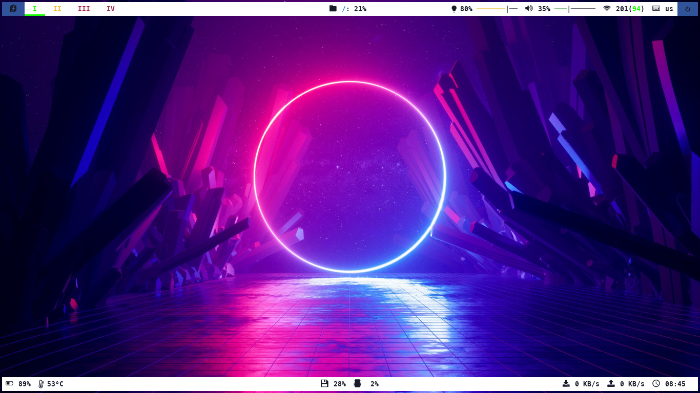

## Table of Contents
- [Introduction](#Introduction)
- [Installation](#Installation)
- [Configuration](#Configuration)

## Introduction
This is my config for bspwm (a window manager) and polybar (a status bar) on my laptop.<br />

My OS information:
- Fedora 34 (Workstation Edition) x86_64
- Kernel: 5.15.14-100.fc34.x86_64
- Shell: zsh 5.8

## Installation
- Zsh
  - [Install zsh](https://github.com/ohmyzsh/ohmyzsh/wiki/Installing-ZSH)
  - [Install oh my zsh(optional)](https://github.com/ohmyzsh/ohmyzsh)
  - [Customize oh my zsh](https://www.sitepoint.com/zsh-tips-tricks/)
- Bspwm
  - First, move to 'Downloads' directory (or anywhere you'd like to install) `cd ~/Downloads`.<br />
  - Clone bspwm and sxhkd git repositories:
    ```
    git clone <a href="https://github.com/baskerville/bspwm.git" rel="nofollow">https://github.com/baskerville/bspwm.git</a>
    git clone <a href="https://github.com/baskerville/sxhkd.git" rel="nofollow">https://github.com/baskerville/sxhkd.git</a>
    ```
    <br />
  - Next, move to bspwm or sxhkd directory (`cd bspwm` or `cd sxhkd`) and run: `make & sudo make install`.<br />
  - Then, we will make a directory to copy the base configuration files for bspwm and sxhkd.
    ```
    mkdir ~/.config/bspwm
    mkdir ~/.config/sxhkd
    
    cp /usr/share/doc/bspwm/examples/bspwmrc ~/.config/bspwm/
    cp /usr/share/doc/bspwm/examples/sxhkdrc ~/.config/sxhkd/
    
    chmod +x ~/.config/bspwm/bspwmrc
    chmod +x ~/.config/sxhkd/sxhkdrc
    ```
  - Change the terminal emulator in 'sxhkdrc' to whatever you're using ( for me it's gnome-terminal). It may look like this:
    ```
    # terminal emulator
    super + Return
            gnome-terminal
    ```
    > **_NOTE:_** You may need to change from `super + Return` to something else like `ctrl + alt + t` in case you don't have the 'Return' key or if you prefer another keybinding for it. 
  - Now logout. After that, during login, click the "gear" icon  (at the bottom right of the screen) and select 'bspwm'. 
    > **_NOTE:_** If all went according to plan, you should be presented with a blank screen. That's good. Open up your preferred terminal using whatever key combination / terminal name you chose in your .config/sxhkdrc. If not, see more at [here](https://github.com/windelicato/dotfiles/wiki/bspwm-for-dummies)
- Polybar
  - [Install polybar](https://github.com/polybar/polybar#installation)
  - [Run polybar](https://github.com/polybar/polybar/wiki)
    >**_NOTE:_** At [lauch section](https://github.com/polybar/polybar/wiki#launching-the-bar-in-your-wms-bootstrap-routine), they say `Make sure you use the name(s) of the bar(s) from your config.`. In case you can't find it, it's actually in ~/.config/polybar/config, at the line `[bar/example]`. You can change it like this `[bar/mybar]` or just keep at way :).


## Configuration   
Details in doc ( Because this is already too long :V ).
    
