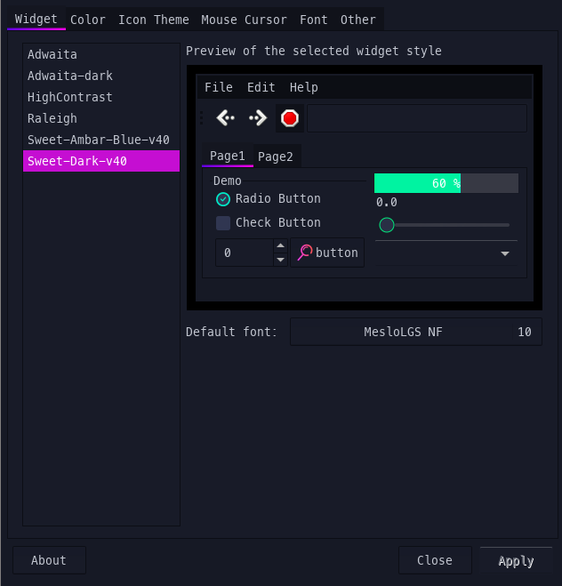

# Tables of contents
- [Warning](#Warning)
- [Configure](#Configure)
- [Addition](#Addition)

## Warning
Some of my configuration for polybar may not work for you, so please check the [polybar wiki](https://github.com/polybar/polybar/wiki) for more information about the modules, the bars, etc.

## Configure
- [Bspwm](#Bspwm)
- [Sxhkd](#Sxhkd)
- [Fonts](#Fonts)

### Bspwm
Set wallpaper for bspwm: 
1. Install `feh`: run `sudo dnf install feh` on Fedora or `sudo apt-get install feh` on Ubuntu.
2. In ~/.config/bspwm/bspwmrc, add: `feh --bg-fill ~/Downloads/img/wallpaper.jpg` (change the path to where you keep your wallpaper/background image).

Change themes, fonts, cursors, etc, install `lxappearance`. Run it and a window will pop up. Use it to customize your settings. When you're done, click "Apply" before closing.<br />


Screen lock:
- Install [betterlockscreen](https://reposhub.com/linux/miscellaneous/pavanjadhaw-betterlockscreen.html).

### Sxhkd
Install `scrot` for screen shot. ([How to use scrot](https://wiki.archlinux.org/title/Screen_capture#scrot))<br />
Install `brightnessctl` for adjusting screen brightness. ([How to use brightnessctl](https://github.com/Hummer12007/brightnessctl#usage))

### Fonts
Install siji font:
```
git clone https://github.com/stark/siji && cd siji
./install.sh -d ~/.fonts
```
After that, run `cp ./view.sh ~/.local/bin` so that next time you open terminal, you just need to type view.sh and a window will pop up.
>**_NOTE:_** Remember to add these in bspwmrc:
```
xset +fp $HOME/.fonts
xset fp rehash
```
Install MesloLGS NF font:
1. Download these files:
  - [MesloLGS NF Regular.ttf](https://github.com/romkatv/powerlevel10k-media/raw/master/MesloLGS%20NF%20Regular.ttf)
  - [MesloLGS NF Bold.ttf](https://github.com/romkatv/powerlevel10k-media/raw/master/MesloLGS%20NF%20Bold.ttf)
  - [MesloLGS NF Italic.ttf](https://github.com/romkatv/powerlevel10k-media/raw/master/MesloLGS%20NF%20Italic.ttf)
  - [MesloLGS NF Bold Italic.ttf](https://github.com/romkatv/powerlevel10k-media/raw/master/MesloLGS%20NF%20Bold%20Italic.ttf)
2. Double-click on each file and click "Install". This will make `MesloLGS NF` font available to all applications on your system.

## Addition
- If you're using Gnome, then why not take a look at this [website](https://www.gnome-look.org/browse/). For me, I use this [theme](https://www.gnome-look.org/p/1253385/).
- After download the ".tarxz" files that you want, extract them, then move them to `~/.themes/` directory (just create one if you don't have it). Finally, you can set theme in lxappearance.
- For cursors or icons changing, create `~/.icons/` directory. 
